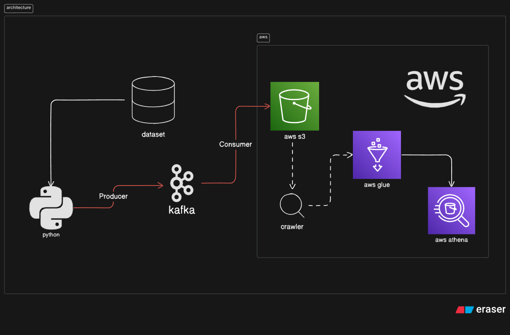

# Kafka Stock Market Stream

Real-time stock market data streaming with Apache Kafka: Python producer and consumer notebooks that publish and consume JSON messages from a Kafka topic, with optional persistence to AWS S3 for querying via Glue and Athena. Setup targets Ubuntu.

## About

This project demonstrates a **streaming pipeline** that ingests stock market data in real time using Apache Kafka, with optional downstream storage and querying on AWS (S3, Glue, Athena). It covers producer/consumer patterns, topic configuration, and integration with a cloud data lake. All configuration (broker, topic name, paths, and AWS settings) is centralized in variables at the top of each notebook.

## Architecture



## Technology Stack

| Component | Technology                      |
| --------- | ------------------------------- |
| Streaming | Apache Kafka                    |
| Language  | Python (`kafka-python`)         |
| Cloud     | Amazon Web Services             |
| Storage   | S3 (Simple Storage Service)     |
| Catalog   | Glue Crawler, Glue Data Catalog |
| Query     | Athena                          |

Python producers/consumers → Apache Kafka (broker) → AWS S3 (raw/processed) → Glue Crawler & Catalog → Athena (SQL queries).

## Dataset

- **Source:** [Stock Market Dataset (Kaggle)](https://www.kaggle.com/datasets/jacksoncrow/stock-market-dataset)
- **Usage:** CSV rows are streamed as JSON messages into a Kafka topic for real-time simulation.

## Prerequisites (Ubuntu)

- **Java 8+** (OpenJDK) — required for Kafka and Zookeeper
- **Python 3.8+** with `pip` — for the producer/consumer scripts or Jupyter notebook
- **Network:** If running Kafka on a remote host (e.g. EC2), ensure port **9092** (and **2181** for Zookeeper if exposed) is reachable from your client

---

## Setup: Apache Kafka on Ubuntu

The following steps assume an **Ubuntu** system (e.g. 20.04 or 22.04 LTS) with `wget` and a JDK.

### 1. Download and extract Kafka

```bash
wget https://downloads.apache.org/kafka/3.6.2/kafka_2.13-3.6.2.tgz
tar -xvf kafka_2.13-3.6.2.tgz
cd kafka_2.13-3.6.2
```

### 2. Install Java (if not present)

Check current version:

```bash
java -version
```

On Ubuntu, install OpenJDK 8:

```bash
sudo apt-get update && sudo apt-get install -y openjdk-8-jdk
java -version
```

### 3. Start Zookeeper

Kafka uses Zookeeper for cluster coordination. Run it in the foreground (or use a process manager in production):

```bash
cd kafka_2.13-3.6.2
bin/zookeeper-server-start.sh config/zookeeper.properties
```

Keep this terminal session open. Use a second terminal (or `tmux`/`screen`) for the next steps.

### 4. Start the Kafka broker

In a **new terminal**:

```bash
export KAFKA_HEAP_OPTS="-Xmx256M -Xms128M"
cd kafka_2.13-3.6.2
bin/kafka-server-start.sh config/server.properties
```

**Remote / EC2 access:** To allow clients outside localhost to connect, set the advertised listeners. Edit `config/server.properties`:

```bash
nano config/server.properties
```

Set `listeners` and `advertised.listeners` to include your instance’s public IP or hostname and port `9092`, for example:

```properties
listeners=PLAINTEXT://0.0.0.0:9092
advertised.listeners=PLAINTEXT://<YOUR_PUBLIC_IP>:9092
```

Replace `<YOUR_PUBLIC_IP>` with your EC2 public IP or DNS. Restart the broker after changes.

### 5. Create a topic

From the Kafka installation directory:

```bash
bin/kafka-topics.sh --create \
  --topic stock-market-index \
  --bootstrap-server localhost:9092 \
  --replication-factor 1 \
  --partitions 1
```

Use `--bootstrap-server <host>:9092` if the broker runs on another machine.

### 6. Run the console producer (optional)

To test the topic with the built-in producer:

```bash
bin/kafka-console-producer.sh --topic stock-market-index --bootstrap-server localhost:9092
```

Type messages and press Enter; they will be written to the topic.

### 7. Run the console consumer (optional)

In another terminal, read from the same topic:

```bash
bin/kafka-console-consumer.sh --topic stock-market-index --bootstrap-server localhost:9092 --from-beginning
```

---

## Running the Python producer

The project includes a Jupyter notebook (`KafkaProducer.ipynb`) that streams rows from a processed stock index CSV into Kafka.

1. **Install dependencies:**

   ```bash
   pip install kafka-python pandas
   ```

2. **Prepare data:** Place `indexProcessed.csv` (from the Kaggle dataset or your own processed file) in the project root.

3. **Configure the broker:** In the notebook, set `bootstrap_servers` to your Kafka broker (e.g. `['localhost:9092']` for local, or `['<EC2_IP>:9092']` for a remote broker).

4. **Run the notebook:** Execute the cells to create the producer, load the CSV, and run the loop that samples a row per second and sends it to the topic `stock-market-index`. Use `producer.flush()` when you want to ensure all messages are delivered before stopping.

---

## Running the Python consumer

The project includes `KafkaConsumer.ipynb`, which consumes messages from the same topic and can persist them to S3 (aligning with the architecture: Kafka → S3 → Glue → Athena).

1. **Install dependencies:**

   ```bash
   pip install kafka-python s3fs
   ```

2. **Configure the broker:** Set `bootstrap_servers` in the notebook to match the producer (e.g. `['localhost:9092']` or `['<EC2_IP>:9092']`).

3. **Run the consumer:** Execute the cells to create the consumer and iterate over messages from `stock-market-index`. Messages are deserialized from JSON automatically.

4. **Optional — persist to S3:** If you use the S3 cells, set your AWS credentials (or rely on `AWS_ACCESS_KEY_ID` / `AWS_SECRET_ACCESS_KEY` in the environment) and replace `<YOUR_BUCKET_NAME>` with your S3 bucket. The notebook can write each consumed message as a JSON file under that bucket (e.g. `stock_market_0.json`, `stock_market_1.json`, …) for later use with Glue Crawler and Athena.

**Suggested order:** Start the producer (or leave it streaming), then run the consumer in another notebook session or machine so both use the same broker and topic.
